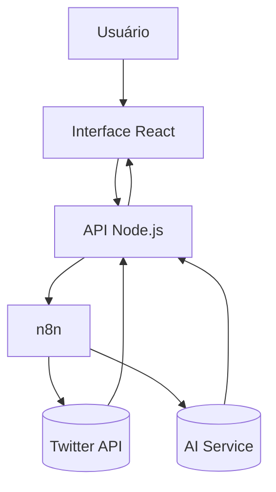

#  🐾 FURIA Chat - Documentação do Projeto

## 🚀 Visão Geral do Projeto

Aplicação web interativa desenvolvida para fãs da **FURIA Esports**, integrando um chat inteligente com informações em tempo real sobre a equipe. O sistema combina:

- **Frontend**: Interface dinâmica em **React** para exibição dos jogadores e interação com o chat.
- **Backend**: API construída em **Node.js** responsável pelo gerenciamento das mensagens e comunicação com o n8n.
- **Automação com IA**: Fluxos no **n8n** utilizam uma IA generativa (OpenAI) e fazem integrações externas como o Twitter.
- **Dados em Tempo Real**: Atualizações automáticas via webhooks e consumo de APIs.

---

## 🛠️ Funcionalidades Principais

### 1. Chat Inteligente
- Respostas personalizadas com estilo “Pantera da FURIA” via llama3-8b-8192.
- Integração com automações no n8n usando webhooks.
- Possibilidade de solicitar informações específicas, como o último tweet.

### 2. Integração com Twitter
- Scraper automático de tweets via Apify.
- Armazenamento dos dados em tempo real no Airtable.
- Consulta ao último tweet via IA, exibido no chat mediante solicitação do usuário.

### 3. Carrossel Interativo de Jogadores
- Exibição visual com fotos, funções e títulos criativos dos jogadores da FURIA R6.
- Miniaturas interativas com efeitos visuais.
- Descrição individual.

---

## 🔄 Fluxo de Funcionamento



## 📸 Capturas de Tela

### Interface do Usuário  


### Fluxo no n8n  


### Excalidraw  


---

## ⚙️ Configuração do Projeto

### ✅ Pré-requisitos
- Node.js v18+
- Conta no [n8n](https://n8n.io/) (self-hosted ou cloud)
- Chave da API da Groq (llama3-8b-8192)
- Token de acesso à API do Apify (para scraping do Twitter)
- Conta e base configurada no Airtable

---

### ▶️ Passos para Execução

#### Frontend
```bash
cd frontend
npm install
npm run dev
```
#### Backend
```bash
cd backend
npm install
npm start
```
## 🌐 Arquitetura da Solução

O fluxo de dados do sistema é dividido em quatro camadas principais:

- **Usuário**: Interage com a interface em React.
- **Frontend (React)**: Captura as mensagens e exibe as respostas.
- **Backend (Node.js)**: Recebe as mensagens, repassa para o n8n e formata as respostas.
- **n8n**: Automatiza a lógica com IA e integração com APIs externas (como o Twitter).
- 

## Desenvolvido com ❤️ pela Comunidade FURIA
## Inspirado na energia da torcida e no espírito competitivo do time 🐾


